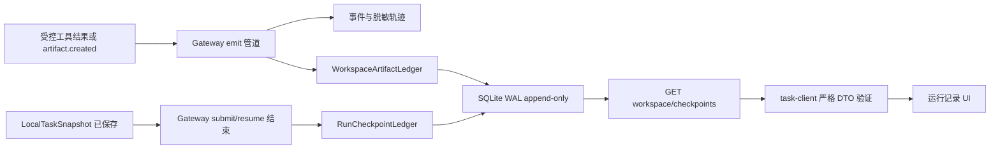

# P11：工作区产出与检查点账本设计

状态：已批准实施

## 1. 目标

P11 为 AI Work OS 增加运行级**产出物账本**和**检查点账本**。用户可以在运行记录中查看一个任务产生了哪些受控引用、每个检查点对应的状态、何时产生、为何可恢复；系统仍不把任何记录解释为命令、审批或权限凭据。

这项设计借鉴了成熟 Agent 产品将计划、隔离执行、可审查结果与恢复点分离的模式。[1] [2] [3] [4] 但实现保持 Windows-first、本地优先与最小权限：P11 不创建 Git 分支、Git worktree、后台代理、通用文件系统浏览器或自动恢复。

## 2. 架构决策

| 决策 | 方案 | 理由 |
|---|---|---|
| 领域边界 | `@awo/agent-runtime` 新增 `run-workspace-ledger.ts` | 账本只理解 `taskId/runId`、可控 reference、摘要哈希和恢复状态；无 HTTP、UI、环境变量或 SQLite 创建。 |
| 存储 | `SqliteRunWorkspaceLedgerStore`，WAL、append-only | 与现有快照/轨迹账本保持一致，允许未来替换为 Rust adapter；每条 checkpoint 由 `(taskId, runId, sequence)` 唯一标识。 |
| 写入点 | Gateway 的 `emit` 统一管道与任务 submit/resume 结果 | TaskEvent 已是经过现有策略/审批控制的领域事件；账本只能投影 metadata，不能拦截或启动工具。 |
| 产出物来源 | 仅 `tool.result` 且 `status=ok` 的 `outputRef`，以及 `artifact.created` | 禁止记录 tool args、正文、prompt、秘密、绝对路径与任意输出内容。`outputRef` 必须使用允许的受控 URI scheme。 |
| checkpoint 来源 | 每次任务快照完成写入后，由 Gateway 使用快照与当前 artifact manifest 创建 immutable checkpoint | checkpoint 是状态快照的引用而非执行计划；`canResume` 仅表示有可恢复请求，不能授予继续执行。 |
| HTTP | 版本化只读 GET 路由：`workspace` 与 `checkpoints`；无新增自动化 POST | Workbench 可看到账本，但所有恢复仍继续走已有 `resume` 或 `approval` 意图与其幂等收据。 |
| UI | 运行记录页增加“运行产出与检查点”组件 | 用可读摘要替代冷诊断；模型连接继续保持默认首屏。 |

## 3. 不变量

1. API key、credential reference 以外的秘密值、prompt、模型输出正文、任意 tool args/result、绝对本地路径与外部 URL 不得进入账本、事件、DTO 或 UI。
2. `outputRef` 仅可为 `local://task/<taskId>/<nodeId>` 或 `artifact://<id>`；任何不匹配的引用都拒绝入账。
3. Ledger 是 append-only metadata 投影。它不能创建文件、读取文件、启动进程、监听端口、调用 provider 或复放副作用。
4. checkpoint 不能改变 profile、authorityMode、input provenance 或 approval 状态。恢复必须重新使用现有 `LocalTaskRuntimeService.resume()` 与策略链。
5. HTTP route 仅通过 `GatewayDependencies` 注入的领域服务读写；不得创建 SQLite、读取环境变量或调用 Node 进程 API。
6. WebView 只通过 `task-client` 使用经运行时校验的 DTO；不得直接导入 SQLite、Node 文件系统、子进程或环境变量。

## 4. 领域 DTO

### 4.1 RunWorkspaceArtifactV1

```ts
{
  schemaVersion: 1,
  artifactLedgerId: 'artifact-ledger:<eventId>',
  sourceEventId: string,
  taskId: string,
  runId: string,
  nodeId: string,
  reference: 'local://task/<taskId>/<nodeId>' | 'artifact://<id>',
  referenceDigest: string,
  kind: 'tool-output' | 'declared-artifact',
  status: 'available',
  at: number,
  containsSensitiveContent: false,
  canReplaySideEffects: false
}
```

### 4.2 RunCheckpointV1

```ts
{
  schemaVersion: 1,
  checkpointId: 'checkpoint:<taskId>:<runId>:<attempt>',
  taskId: string,
  runId: string,
  attempt: number,
  status: TaskRunStatus,
  nodeOutcomeDigest: string,
  artifactManifestDigest: string,
  artifactCount: number,
  createdAt: number,
  canResume: boolean,
  canReplaySideEffects: false
}
```

## 5. 写入与查询流程



## 6. 验证策略

单元测试覆盖 URI 允许列表、秘密字段拒绝、事件幂等、checkpoint 不可覆盖、SQLite round-trip、关闭资源。Gateway 合约测试覆盖新路由只读性、路由不直接使用 Node SQLite/environment、CSP 与 Workbench Node 禁令不回归。全量 TypeScript、Rust、Python、审计与 Windows Tauri 构建门继续作为提交前要求。

## References

[1] [GitHub Docs — About GitHub Copilot cloud agent](https://docs.github.com/copilot/concepts/agents/cloud-agent/about-cloud-agent)

[2] [GitHub Docs — GitHub Copilot cloud agent](https://docs.github.com/en/copilot/how-tos/use-copilot-agents/cloud-agent)

[3] [Claude Code Docs — Run parallel sessions with worktrees](https://code.claude.com/docs/en/worktrees)

[4] [Anthropic — Enabling Claude Code to work more autonomously](https://www.anthropic.com/news/enabling-claude-code-to-work-more-autonomously)
