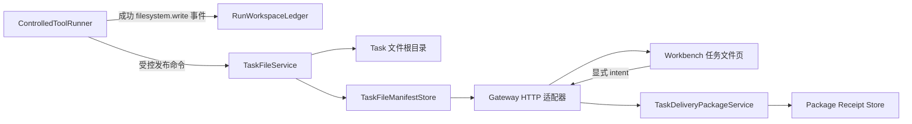

# P13：任务专项文件、代码协作预览与显式交付包设计

**状态：** 已批准进入实现  
**日期：** 2026-08-20  
**范围：** Windows 优先的本地 Gateway、Workbench 和 `@awo/agent-runtime`。  
**相关调研：** [P13 任务文件、代码预览与交付模式调研](../research/p13-task-files-code-preview-and-delivery-patterns.md)。

## 1. 决策摘要

P13 将当前的 `RunWorkspaceLedger` 从“可审计的产出引用账本”扩展为两层模型。原账本继续保存**最小、不可变、无路径的事件投影**；新建的任务文件服务负责以 event-driven 的方式登记实际受控文件的公开 metadata、只读预览和用户显式创建的 ZIP 交付收据。两者不互相取代：账本回答“本次运行发生过什么”，文件服务回答“当前任务有哪些可查看、可下载的安全文件”。

> **核心原则：生成文件来自受控工具事件，不来自模型文本。** UI、模型回答、任务 prompt 和任意 `/path` 字符串均不能创建文件条目；只有通过 `filesystem.write` 能力策略、审批门和预算门的工具结果才能发布任务文件。

这套结构吸收 AionUi 的多标签右侧预览和 VS Code 的 Files/Changes 分离理念，同时采纳 OpenCode、OpenClaw 和 Cherry Studio 的 containment、metadata-first、显式交付和会话作用域模式。[1] [2] [3]

## 2. 用户工作流

| 步骤 | 用户可见行为 | 后端事实 | 副作用与审批 |
|---|---|---|---|
| 1. 发起任务 | 在对话工作区提交第三方 API 任务。 | Gateway 创建 task/run；API key 只保留在 provider session 内存。 | 既有任务策略。 |
| 2. Agent 产出文件 | 成功的 `filesystem.write` 工具结果触发一张简短文件提示卡，右侧面板自动选中该文件。 | 写入目标仅能是 task/run 专属受控根中的相对路径；结果经文件登记服务归档 metadata。 | 受既有 Profile、审批和预算门控；无绕过。 |
| 3. 查看专项文件 | 用户点击右侧“任务文件”，浏览当前 task/run 的文件清单，按生成时间选择文件。 | Gateway 返回受控 DTO；不返回绝对路径、secret 或原始工具输入。 | 只读，无审批。 |
| 4. 看代码和变更 | 右侧预览显示代码行号、语法类型、首批受限文本内容；变更视图显示与上一同路径版本的统一 diff。 | 内容读取仅通过 artifact ID 与 task/run 匹配校验；大文件截断并附带 `truncated`。 | 只读，无直接 WebView 文件访问。 |
| 5. 创建交付包 | 用户在“交付包”页点击“创建 ZIP 交付包”。 | Gateway 收集当前 task/run 的 allowlisted 文件，构建临时 ZIP，计算每项和包的 SHA-256，并登记 immutable receipt。 | **显式用户 intent + Idempotency-Key**；不自动执行、不覆盖任意文件。 |
| 6. 下载 | 用户点击包卡片的“下载”。 | 桌面宿主通过受控下载/另存为流程取得单一受控包引用。 | 无运行或解压；取消不会产生任何覆盖。 |

## 3. 领域模型与职责



| 构件 | 责任 | 禁止承担的责任 |
|---|---|---|
| `RunWorkspaceLedger` | 继续投影 tool/artifact 事件、检查点和受控逻辑引用。 | 不保存路径、内容、MIME 或可下载字节。 |
| `TaskFileService` | 验证写入意图，安全解析相对路径，写入 task/run 根目录，生成 metadata、哈希与版本信息。 | 不读取 UI 传入的任意路径，不访问 credential store，不执行文件。 |
| `TaskFileManifestStore` | append-only 保存 task 文件版本的脱敏 metadata 与包收据。 | 不存文件内容、API key、prompt、绝对路径。 |
| `TaskFilePreviewService` | 按 task/run/file ID 检查归属和 allowlist，返回有上限的只读文本或 metadata。 | 不暴露目录列表、不渲染/运行任意 HTML/JS。 |
| `TaskDeliveryPackageService` | 在显式请求下将同一 task/run 的 available 文件复制到临时目录并生成 ZIP、manifest、哈希与收据。 | 不自动触发、不能接受自定义 source path、不能解压/运行内容。 |
| Gateway routes | 解析 HTTP，验证 query/body contract，调用注入服务。 | 直接 `fs`、`node:sqlite`、监听端口、读取环境变量。 |
| Workbench | 选择当前 task/run、显示 DTO、发出用户 intent。 | 读本机文件、写入数据库、持有 secret、调用 provider。 |

## 4. 受控文件合同

P13 首期将文件能力限制为文本和代码类型。允许的扩展名为 `.txt`、`.md`、`.json`、`.csv`、`.ts`、`.tsx`、`.js`、`.jsx`、`.py`、`.rs`、`.css`、`.html` 和 `.yaml`/`.yml`；每个文件最大 **256 KiB**，每个 task/run 最多 **64 个**任务文件，单次交付包最多 **16 MiB**。HTML 首期只允许显示源代码，不在 Workbench 执行或 iframe 渲染。

```ts
interface TaskFileRecordV1 {
  schemaVersion: 1;
  taskFileId: string;
  taskId: string;
  runId: string;
  artifactLedgerId: string;
  logicalPath: string;        // 仅规范化相对路径，如 reports/summary.md
  displayName: string;
  mediaType: 'text/plain' | 'text/markdown' | 'application/json' | 'text/csv' | 'text/x-source';
  byteSize: number;
  sha256: string;
  version: number;
  createdAt: number;
  status: 'available';
  containsSensitiveContent: false;
  canExecute: false;
}

interface TaskFilePreviewV1 {
  taskFileId: string;
  logicalPath: string;
  language: string;
  content: string;
  lineCount: number;
  truncated: boolean;
  byteSize: number;
  sha256: string;
}

interface TaskDeliveryReceiptV1 {
  schemaVersion: 1;
  deliveryId: string;
  taskId: string;
  runId: string;
  fileCount: number;
  byteSize: number;
  sha256: string;
  createdAt: number;
  status: 'available';
  canAutoExecute: false;
  canAutoExtract: false;
}
```

`logicalPath` 是展示与包内路径，不是机器绝对路径。写入时把它解析到 `task-files/<taskId>/<runId>/` 内，调用 `realpath` / containment 检查以拒绝 `..`、绝对路径、NUL 字节和符号链接逃逸。首期写入使用排他创建与版本化文件名；不会覆写既有 user 文件。

## 5. HTTP 与 Workbench 合同

| Route | 方法 | 目的 | 响应边界 |
|---|---:|---|---|
| `/api/tasks/:taskId/:runId/files` | `GET` | 返回当前任务专项文件清单。 | `TaskFileRecordV1[]`，无绝对路径、文件字节或 secret。 |
| `/api/tasks/:taskId/:runId/files/:fileId/preview` | `GET` | 返回受限只读文本预览。 | `TaskFilePreviewV1`；只读、截断、归属校验。 |
| `/api/tasks/:taskId/:runId/files/:fileId/diff` | `GET` | 返回同逻辑路径上一版本的受限 diff。 | 只含统一 diff 文本和版本 metadata；无文件系统路径。 |
| `/api/tasks/:taskId/:runId/deliveries` | `GET` | 返回 task/run 的交付包收据。 | `TaskDeliveryReceiptV1[]`。 |
| `/api/tasks/:taskId/:runId/deliveries` | `POST` | 显式创建 ZIP 交付包。 | 必须带 `Idempotency-Key`；仅接受固定 task/run，无 source path 参数。 |
| `/api/tasks/:taskId/:runId/deliveries/:deliveryId` | `GET` | 取得交付包的受控下载描述。 | 首期只返回受控 metadata/receipt；桌面“另存为”桥接另行实现。 |

Workbench 的 `TaskFilesPanel` 从 `activeRun` 派生 task/run。它包含“文件”“代码变更”“交付包”三张标签页：文件页显示受控清单并可打开预览；代码变更页过滤 source 文件、展示选择项和 diff；交付包页显示创建操作、可验证收据和下载状态。`PreviewPanel` 保留知识引用页，但移除本地草稿的伪文件语义，改为接收一个显式 `selectedTaskFile`。

## 6. 菜单与可访问性

任务工作区的主次导航遵循 P12 的 AionUi 风格：主侧栏仍用于任务与全局设置；当前 task/run 的操作集中在对话顶部轻量切换区，右侧面板是内容协作空间。不会增加隐蔽的右键专属关键功能。

所有文件与交付操作使用真实 `<button>`，含可见文本和 `aria-label`；标签具有 `role="tablist"`、`role="tab"` 与 `aria-selected`；空状态说明“不显示其他任务文件”。CSS 支持 1280px 以上三栏、窄窗口折叠为可切换右侧面板，不能因为预览区域引入滚动劫持或不可访问悬浮操作。

## 7. 安全边界与非目标

> **P13 不是通用文件管理器，也不是无审批的代码执行器。** 它是让用户审查由受控 Agent 工具产出的 task 文件并显式领取交付包的最小垂直切片。

| 已实现安全约束 | P13 明确不做 |
|---|---|
| Profile 仍然只可收紧；`filesystem.write` 必须通过既有 policy / approval / budget。 | 用户任意磁盘浏览、从 UI 输入路径读取、递归打包任意目录。 |
| 任务、运行、artifact、file、delivery 全部相互匹配；不跨任务回退查询。 | 自动下载、自动解压、自动打开、自动执行产出文件。 |
| 预览 DTO 和 SQLite metadata 均禁止 API key、prompt、tool args、原始 provider response 和绝对路径。 | 默认运行 HTML、脚本、二进制或 Office/PDF 内嵌宏。 |
| ZIP 构建采用临时目录、allowlist、条目数/大小限制、哈希验证、原子 rename。 | 为“兼容预览”放宽桌面 CSP 或加入 `unsafe-eval`。 |

## 8. 实施顺序与验收

第一步实现领域端口、内存/SQLite metadata store、路径 containment、文本预览、版本 diff 和 delivery receipt，同时为每个越权和限额路径编写测试。第二步将服务在 Gateway composition root 装配，但提取已有 helper 以保持 root **不超过 350 行**。第三步添加路由、DTO guard 与 HTTP 契约。第四步扩展 Workbench 客户端、`PreviewPanel`、任务文件列表、交付包 UX 和 i18n/CSS。最后执行全量质量门、Windows source provenance，并在真实 Windows 环境完成应用启动、文件预览和显式包创建验证。

验收以真实点击链为准：选择活跃任务 → 查看只有该 task/run 的文件 → 打开 TypeScript 文件看到只读代码/行号与版本 diff → 点击创建交付包 → 收到哈希、文件数和大小的 receipt → 下载动作仅在用户再次点击后发生。任何非 allowlisted 扩展名、traversal、错误 task/run/file 对、超限预览、没有 Idempotency-Key 的交付请求都必须被拒绝且不留下可用文件或包记录。

## References

[1]: ../research/p13-task-files-code-preview-and-delivery-patterns.md "P13 task-files research"
[2]: https://github.com/iOfficeAI/AionUi/wiki/Preview-Panel-Guide "AionUi Preview Panel Guide"
[3]: https://github.com/CherryHQ/cherry-studio/issues/15708 "Cherry Studio generated artifacts"

## 9. 实际 Workbench 视觉验证记录

2026-08-20 在本地 Vite Workbench 中验证：设置页可返回工作区；工作区呈现左侧导航、中部任务对话/审批区、右侧任务专项文件栏的三栏桌面布局。右侧标签“文件、代码、差异、交付包、引用”均作为真实可点击按钮渲染；无活跃任务时文件页显示隔离空状态，不显示任何工作区或系统路径。该结果符合 P13 首期的 task/run 作用域和预览优先交互目标。

后续实际任务验证应使用本机 Gateway：提交 Build 任务 → 显式批准 `filesystem.write` → 文件列表出现 `deliverables/task-delivery.md` → 点击“代码”检查只读预览 → 点击“交付包”创建 ZIP 并手动下载。

## 10. 最终验证结论

| 门禁 | 结果 |
|---|---|
| 架构边界检查 | 通过；212 个模块、568 条依赖均无违规。 |
| Gateway composition root | 347 行，符合不超过 350 行的预算。 |
| TypeScript | 根 `npm run typecheck` 通过。 |
| 测试 | 根 `npm run test` 通过：219/219。新增领域、Gateway HTTP 与 Workbench DTO 回归均通过。 |
| Workbench 生产构建 | 通过；JavaScript 产物约 322 KB（未 gzip）。 |
| Rust 控制面 | `process-supervisor` 11/11 通过；`windows-native-host-helper` 2/2 通过；两者均通过 Clippy `-D warnings`。 |
| Python / sidecar / 审计 | Python 编译通过；Gateway sidecar 构建通过；生产依赖审计 0 vulnerabilities。 |
| 桌面安全契约 | 7/7 通过；CSP 仍禁止 `unsafe-eval`，sidecar 仍固定 loopback。 |

P13 交付的安全结论是：任务文件的真实内容只保存在 task/run 专属受控目录中；SQLite、事件、文件清单和交付收据只保存 metadata；预览读取、diff、下载和 ZIP 均在 task/run/file ID 三重匹配和完整性验证后进行。交付包需要用户显式点击创建，下载也必须再次点击；系统从不自动下载、解压、打开或执行生成文件。
