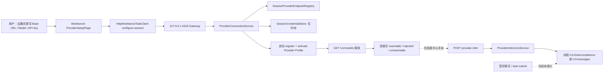

# AtomCode 与 AI Work OS：第三方 API 连接全链条差异与不可用根因

**日期：** 2026-08-22  
**作者：** Manus AI  
**结论级别：** P0 功能缺口已确认

## 执行摘要

用户反馈“仍然无法使用”是合理的。AI Work OS 虽然已经具备**填写地址、写入 Gateway 临时会话、调用 `/models` 探测、在连接中心发起一次受限推理**的局部能力，但它尚未像 AtomCode 一样形成“选择模型 → 解析连接 → 构造 Provider → 将对话/任务实际送往模型 → 展示流式结果”的闭环。最重要的事实是：当前 AI Work OS 的 `ProviderInferenceService` 只由 Provider 连接路由调用；普通聊天输入框提交的是受控 task/run 工作流，不会将用户文本交给已连接 Provider。因此，用户即使连接测试成功，也不能把首页聊天当作真实第三方模型对话使用。[1] [2]

本机诊断还发现，用户当时运行的 Gateway 来自 `D:\software\新建文件夹 (3)\AI Work OS\`，其 sidecar 创建时间为 16:32；本次修复后的本机构建主程序在 `D:\maanuse\AI-Work-OS-local-build\...\target\release\`，完成时间约为 20:54。前者不是最新本机构建目录，因而不能验证后续的地址表单和 Gateway 修复是否被实际运行。这是**部署版本错位**，但不是唯一问题。

> **根本判断：** 当前产品是“可测试的 Provider 控制面 + 尚未接入模型的任务工作台”，而 AtomCode 是“可持久化配置 + 可解析模型选择 + 可构造运行时 Provider + 实际编码 Agent 消费 Provider”的完整产品链。

| 结论 | 严重度 | 对用户的直接影响 |
| --- | --- | --- |
| 首页任务/聊天未消费已连接 Provider | **P0** | 连接成功后仍不能像商业聊天客户端一样真实回答 |
| 用户仍在运行旧安装目录中的 Gateway | **P0 部署** | 新 UI、地址修正和 sidecar 修复未必生效 |
| 地址与密钥只存 Gateway 会话内存 | **P1** | 重启/崩溃后连接丢失，无法形成稳定的日常使用体验 |
| `/models` 探测只给 reachable/rejected | **P1** | 不会把真实可用模型列表回填到模型选择器，难以确认模型名 |
| 连接错误被压缩为少数分类 | **P1** | 用户看不到 HTTP 状态、供应商请求 ID、协议/路径不匹配原因 |
| Built-in Provider 固定目录身份、端点可编辑但协议不可编辑 | **P2** | 自定义网关或特殊兼容服务需要走另一条 custom 路径，体验割裂 |

## 一、当前 AI Work OS 的真实连接链路

### 1. 设置表单与地址处理

当前 UI 已在**原有 API 设置页**将“连接地址 / Base URL”放在 API key 上方。每个内置预置带一个可编辑默认值，内置连接请求将 `baseUrl` 与 `apiKey` 一起提交给 Gateway。自定义 OpenAI/Anthropic-compatible 服务也使用独立地址字段。[3] [4]

Gateway 不把地址返回给 WebView。`SessionProviderEndpointRegistry` 只在当前进程内存保存覆盖值；OpenAI-compatible 地址会把结尾 `/v1` 归一化为根路径，随后探测和推理层分别补上 `/v1/models` 与 `/v1/chat/completions`。因此，用户输入 `https://token-plan-cn.xiaomimimo.com/v1` 在当前设计中会被规范化后再次正确组合为小米 Token Plan 中国区路径。[5] [6]

### 2. 凭据、状态与探测

`configureSession` 将 API key 写入 Gateway 的会话凭据存储，自动登记并激活内置 Provider Profile；随后 Workbench 显式调用 `/probe`。MiMo 按量和 Token Plan 使用 `api-key` 头；其他 OpenAI-compatible 内置服务默认 Bearer；Anthropic 使用 `x-api-key`。[6]

该设计的优点是浏览器、SQLite 状态 DTO、任务事件和连接列表不回显 key 或 endpoint。缺点是端点与密钥没有稳定的本机持久连接档案：Gateway 进程退出后，用户必须重新输入。显示名称和模型名称也只是一层会话投影，不是可复用账户/模型数据模型。[6]

### 3. 真实推理与任务聊天之间的断层

源代码检索表明 `ProviderInferenceService` 被 Gateway 组合根和 `/api/providers/connections/:id/infer` 路由引用；Workbench 只有 Provider 连接中心会调用 `inferProviderConnection`。任务提交与 task/run 执行链没有该 Provider 调用点。[1] [2]

这意味着当前“连接并测试”只能证明 Gateway 能向远程 API 发 `/models`，连接中心的手动 inference 才能证明一次 chat completion；它**不能**证明或实现首页对话、任务计划、代码生成、文件生成会使用该 API。这是用户体验上“配置了仍不能用”的主因。

## 二、AtomCode 的完整连接链路

```mermaid
flowchart LR
  U[用户：Provider / Account / Model 表单] --> D[AtomCode daemon API]
  D --> V[验证 name / type / model / Base URL]
  V --> X[可选 GET /models discovery]
  X --> L[模型列表 + 可手填 fallback]
  L --> P[持久化 ProviderAccount + ModelProfile]
  P --> R[Config resolve_model]
  R --> F[ResolvedModelConfig]
  F --> B[Provider Factory]
  B --> O[OpenAI / Anthropic / Ollama Adapter]
  O --> C[实际 Coding Agent / session]
  C --> UI[流式结果与任务执行]
```

AtomCode 将**供应商预置、账户、模型档案**明确分层：账户保存 provider id、可覆盖的 `base_url`、凭据与 User-Agent；模型档案只保存模型名、能力和上下文限制。`resolve_model` 将“预置默认值 + 账户覆盖 + 模型档案 + 环境变量凭据”解析成唯一的 `ResolvedModelConfig`，所有运行时 Provider 构造都消费这个解析结果。[7] [8]

AtomCode 的模型发现 API 接受 `type`、`base_url`、可写入的 `api_key` 和可选 provider name。它按协议构造 `/models` 或 Ollama `/api/tags`，设置 10 秒超时、4 MiB 响应限制、2,000 模型上限，并分别返回超时、HTTP 状态、传输失败或模型数组格式错误。若模型发现不支持或失败，界面仍允许手工填模型名。[9]

最终，AtomCode 的 Provider Factory 根据 `provider_type` 构造 OpenAI-compatible、Anthropic 或 Ollama Adapter，并把解析后的地址、模型、密钥、重试策略、User-Agent、思考策略等带到实际 Coding Agent 的请求路径中。也就是说，AtomCode 的配置和任务执行共享同一解析对象，没有“设置页面成功但聊天链没接上”的断层。[10]

## 三、逐链路对照

| 链路节点 | AtomCode | AI Work OS 当前实现 | 影响与判断 |
| --- | --- | --- | --- |
| 服务预置 | 预置可作为账户引用，字段可被账户覆盖 | 静态内置 catalog；允许 session base URL 覆盖 | AI Work OS 有可编辑地址，但覆盖生命周期短 |
| 地址输入 | 创建、Patch、Discover 都接受 `base_url` | configure-session 接受 `baseUrl`；custom 单独配置 | 功能覆盖部分相近，但两条 UI/数据路径割裂 |
| 地址归一化 | discovery 保留用户 path 并追加 `/models` | OpenAI 路径会去掉末尾 `/v1`，再由 adapter/probe 补回 | 对小米官方 `/v1` 合理；对非标准兼容网关需明确测试 |
| 网络目标 | discovery 支持 `http` 与 `https`，可配自签证书跳过校验 | 仅公开 HTTPS、标准端口、DNS 主机；拒绝 localhost/IP/内网 | AI Work OS 更强 SSRF 防护；但不适合作为本地/企业自托管统一入口 |
| 密钥处理 | 配置/环境变量解析；持久化模型账户可复用 | Gateway 内存会话；不投影到 UI/SQLite | AI Work OS 更少落盘暴露，但重启后不可用，缺少 Windows 凭据库方案 |
| 模型发现 | 解析模型列表并返回给 UI；失败仍可手填 | 只返回 reachable/rejected/unreachable，不返回模型 ID | UI 无法利用真实 discovered models，排错和选择都弱 |
| 探测错误 | 区分超时、HTTP 状态、响应过大、格式非法、网络失败 | 压缩为 rejected/unreachable 等，再由 UI 生成泛化中文文案 | 供应商端点/套餐/认证问题难以自助定位 |
| 协议/鉴权 | provider type 决定 adapter；配置可携带 UA/retry/TLS 选项 | 内置适配器按 catalog 固定；MiMo 特殊 `api-key` 已支持 | MiMo TP 是正确修复；其它非标准兼容服务扩展性不足 |
| 配置→运行时 | `resolve_model` 是唯一解析边界，Factory 直接构造 Agent Provider | 连接控制面与任务执行面分离 | **P0：首页任务没有消费 Provider** |
| 任务结果 | Agent session 实际使用 Provider 流式响应 | task/run 目前按受控工作流产生状态与产物，不接第三方 LLM | 用户不能得到预期的商业模型聊天/代码生成能力 |
| 桌面部署 | daemon/config 是运行时常驻面 | Tauri 通过 fixed loopback sidecar 启动 Gateway | 当前用户实际运行的仍是旧安装目录 sidecar，构建更新未等于运行更新 |

## 四、已证实的根因

### 根因 A：正在运行的不是最新本机交付版本

本机进程检查发现运行中的 `awo-runtime-gateway.exe` 来自 `D:\software\新建文件夹 (3)\AI Work OS\`，并非新交付目录 `D:\maanuse\AI-Work-OS-Installer\local-build\`。旧 sidecar 文件创建时间为 16:32；最新本机构建主程序完成于约 20:54。用户需要先关闭旧应用/旧 Gateway，再手动安装并启动最新包，才会实际拥有最新地址表单与构建修复。

### 根因 B：产品没有把 Provider 接到首页任务执行

这不是安装包、API key 或小米地址单点问题。即使 `/models` 返回 reachable，普通聊天和 task/run 也不会调用 `ProviderInferenceService`。当前软件实际是一套任务工作台骨架，而不是已接通主对话的第三方模型客户端。该问题必须通过代码将“已激活的连接”显式绑定到聊天/任务推理执行器解决，而不是继续增加预置或放松网络规则。

### 根因 C：可编辑地址仍然是易失会话配置

AI Work OS 关闭 Gateway 后就忘记 endpoint 与 API key，下一次运行用户只能重新输入。AtomCode 的账户/模型档案将 endpoint、模型名与非机密 metadata 作为稳定本地配置；AI Work OS 需要至少提供一个**本机加密凭据引用 + 持久 endpoint/model metadata** 的账户模型，使用 Windows Credential Manager 或同等安全存储保存密钥，而不是把密钥明文写入 SQLite。

## 五、最小修复路线

| 优先级 | 改动 | 验收标准 |
| --- | --- | --- |
| P0-1 | 新增 `ActiveProviderResolver`，由任务/聊天执行器在用户明确选择已连接模型后调用 `ProviderInferenceService` | 在首页发送简单文本，能获得该模型的流式/聚合回答；任务事件记录 Provider ID 与模型名但不记录 endpoint/key |
| P0-2 | 在桌面启动时显示运行中 Gateway 的 app build/version 与 sidecar path 摘要 | 用户能判断是否正在使用最新安装包；旧 sidecar 不能静默占用 4318 端口 |
| P1-1 | 将 probe 扩展为有上限的模型发现，并允许用户从返回列表选择或手填 | MiMo `/models` 返回的模型可选；模型列表失败不阻塞手动输入 |
| P1-2 | 新增本机账户/模型档案：持久 endpoint、protocol、model、displayName；key 放 Windows Credential Manager 引用 | 重启后地址和模型仍在；key 不出现在 JSON/SQLite/日志/UI 响应 |
| P1-3 | 返回脱敏诊断：HTTP 状态、供应商 request-id（若有）、分类错误与路径阶段 | 用户能区分错误 key、订阅套餐、错误地址、TLS、DNS、超时与模型不存在 |
| P2 | 让自定义兼容服务使用受控的协议/auth 选项；本地模型保留单独的本地端点管理 | 支持常见商业 API 与显式本地模型，但不让 WebView 成为任意内网代理 |

## 六、下一步验证顺序

1. 手动关闭旧安装目录启动的 AI Work OS 和 `awo-runtime-gateway`，避免旧 sidecar 占用 `127.0.0.1:4318`。
2. 用新安装器安装/覆盖并从新安装目录启动。不要用浏览器预览判断 Gateway，因为浏览器没有 Tauri IPC。
3. 在原 API 设置窗口选择 MiMo Token Plan（中国），确认地址、模型和 API key 后点击“连接并测试”。
4. 记录 UI 显示的探测结果。若仍失败，收集 HTTP 分类诊断；不要在聊天中粘贴 API key。
5. 在完成 P0-1 前，不应承诺首页“开始任务”已经会调用该 Provider；这正是待修复的产品链路缺口。

## 参考资料

[1] [AI Work OS Provider 推理调用点](https://github.com/bear20252026/b07-build/blob/main/apps/runtime-gateway/src/http/routes/provider-connections.ts)

[2] [AI Work OS Workbench Provider 控制面](https://github.com/bear20252026/b07-build/blob/main/apps/workbench/src/runtime/use-provider-control-plane.ts)

[3] [AI Work OS Provider 设置页](https://github.com/bear20252026/b07-build/blob/main/apps/workbench/src/components/settings/ProviderSetupPage.tsx)

[4] [AI Work OS 浏览器请求契约](https://github.com/bear20252026/b07-build/blob/main/apps/workbench/src/runtime/task-client.ts)

[5] [AI Work OS 会话地址覆盖层](https://github.com/bear20252026/b07-build/blob/main/packages/provider-sdk/src/session-provider-endpoints.ts)

[6] [AI Work OS Provider 连接服务](https://github.com/bear20252026/b07-build/blob/main/packages/provider-sdk/src/provider-connection-service.ts)

[7] [AtomCode Provider 账户与模型配置](https://atomgit.com/atomgit_atomcode/atomcode/blob/master/crates/atomcode-config/src/config/provider.rs)

[8] [AtomCode 配置解析边界](https://atomgit.com/atomgit_atomcode/atomcode/blob/master/crates/atomcode-config/src/config/mod.rs)

[9] [AtomCode Provider 管理与模型发现 API](https://atomgit.com/atomgit_atomcode/atomcode/blob/master/crates/atomcode-daemon/src/api_provider.rs)

[10] [AtomCode Provider Factory](https://atomgit.com/atomgit_atomcode/atomcode/blob/master/crates/atomcode-coding/src/provider_factory.rs)

## 七、本轮 P0 修复状态

已新增 `TaskModelInferencePort`，由 Gateway composition root 只在**恰有一个**活动且拥有会话凭据的内置 Provider 时注入任务运行时。任务 DAG 的 `model.chat` 节点现在会将用户目标发送给该 Provider 的现有 `ProviderInferenceService`；模型文本不会写入事件 payload，而是以 `model-output/response.md` 写入当前 task/run 专属文件区，连同 provider、model、延迟和输出摘要形成可审查结果。该端口不接收地址、API key、工具权限或任意网络目标。[11] [12]

新增测试覆盖了“唯一活动 Provider 会收到目标”“没有活动连接时不发远程请求”“多个活动连接时拒绝静默选择”三种情况。全仓测试由 297 项增至 300 项且通过。此修复首先覆盖内置 Provider；自定义 Provider 仍需要下一阶段的显式选择/解析模型，不能误称为已完全接入任务执行。

> 本轮没有再次使用聊天中公开过的密钥，因此不能将源码和单元测试通过表述为对轮换后真实账号的线上验证。用户仍需安装最新版并用新的密钥在桌面端执行“连接并测试”。

[11] [AI Work OS 任务模型推理端口](https://github.com/bear20252026/b07-build/blob/main/apps/runtime-gateway/src/task-model-inference.ts)

[12] [AI Work OS 任务运行时组合](https://github.com/bear20252026/b07-build/blob/main/apps/runtime-gateway/src/task-runtime-composition.ts)
