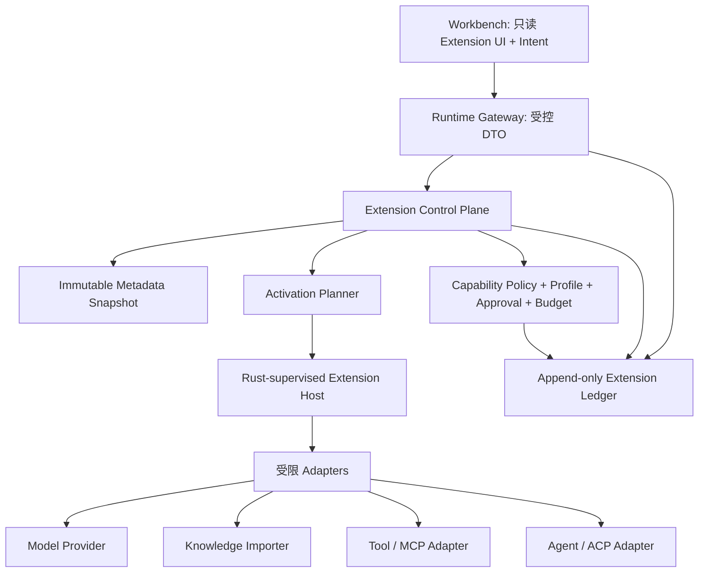

# Controlled Extension Plane：插件化 AI Work OS 架构与路线图

**作者：Manus AI**  
**日期：2026-08-19**  
**适用版本：AI Work OS v0.19.0（受控扩展平面发布归档）**

## 结论

AI Work OS 已完成受控扩展平面的第一阶段交付：在既有能力策略、人工审批、append-only SQLite、会话隔离、Memory Ledger、知识工作区、只读子任务、MCP manifest、健康端点注册表和浏览器安全 DTO 边界之上，落地了 **Controlled Extension Plane（受控扩展平面）**。

> **目标原则：** 任何业务能力都可以被模块化声明；但任何扩展都不因被发现、安装、登记或启用而自动获得执行、密钥、数据库、网络、Shell、浏览器或审批权限。

该路线吸收 OpenClaw 的 manifest-first、capability ownership、activation planning、operator install policy 与 runtime inspection；吸收 DeepSeek-Harness 的可组合能力和单一可追溯 session log；同时保留本项目更严格的“默认拒绝、Profile 只能收紧、记忆不等于权限、incognito 不持久化”铁律。[1] [2]

## 当前版本与健康状态

| 维度 | 当前状态 | 结论 |
| --- | --- | --- |
| GitHub 主分支 | `main` 已推送至 v0.19.0 发布提交 | 以本次发布前 `git status` 与推送结果为准；不保留本地未提交改动。 |
| 产品版本 | 根工程 `0.19.0`；workbench `0.6.0` | 产品版本已覆盖 v0.15.0–v0.19.0 受控扩展平面路线。 |
| 前端生态 | React `19.2.8`、`@lobehub/icons` `5.16.0` | 正式图标组件已接入；Extension Center 使用浏览器安全的只读 Gateway DTO。 |
| 回归验证 | TypeScript `106/106`；Rust `9/9`；生产构建、浏览器与隔离 HTTP 生命周期验证通过 | Extension、Skill Pack、Adapter 与 Schedule 均已有专项和全量回归覆盖。 |
| 代码卫生 | 当前扫描未发现 `TODO`、`FIXME` 或 `HACK` | 无显式遗留占位，但仍存在需要主动建设的系统能力。 |

## 已完成的能力与缺口

| 领域 | 已具备的真实能力 | 仍缺少的能力 | 优先级 |
| --- | --- | --- | --- |
| 扩展治理 | 通用 manifest、来源 SHA-256、状态机、SQLite append-only 账本与 metadata-only discovery | 供应链签名、在线安装与 rollback 仍需在独立供应链设计中实现 | 已完成 |
| 激活路径 | 确定性 activation planner、Doctor、可解释计划理由与审计 store | 与真实受监督 runtime 执行的 claim/lease 接合 | 已完成（控制面） |
| 运行隔离 | Rust Extension Host：直接可执行路径、清空继承环境、版本化最小 IPC、启动期限与崩溃回收 | Adapter transport 的生产 runner 集成 | 已完成（Host 基线） |
| 模型生态 | Provider Profile、凭据引用隔离、driver allowlist、数据边界收紧、回滚/撤销 | catalog 持续同步与凭据提供方 UI | 已完成（控制面） |
| 工作台 | AionUi 风格三栏、Extension Center、diagnostic/Profile/plan 只读可视化 | 管理操作 UI 与审批 inbox 展示可在后续迭代加入 | 已完成（只读控制面） |
| 技能/知识 | 纯文本 Skill Pack、候选审查/发布、digest、显式预算/范围、撤销验证与独立 citation | 受控 importer 与用户可编辑 pack UI | 已完成（治理） |
| Agent 集成 | ACP/CLI manifest、能力协商、独立 session、只读桥与审批 mailbox | Rust Host 驱动的实际协议 transport | 已完成（控制面） |
| 自动化 | 时区化 Schedule manifest、模板 digest、预算、missed slot、独立 runId、审批 inbox | 经实时 policy/runner claim 的实际定时执行宿主 | 已完成（控制面） |

## 目标架构



该设计将 **metadata plane** 与 **runtime plane** 分离。metadata plane 只读取 manifest、来源摘要、版本、声明能力和审查记录；它不 import、spawn、连接或执行插件代码。runtime plane 仅消费激活计划中的已批准扩展，并经由 Rust 监督进程启动受资源限额约束的 adapter。任何扩展的能力决策仍由核心 `CapabilityPolicy`、当前 Profile、任务预算与审批共同决定，而非由 manifest 自我声明。

## Extension Manifest v1

应先实现一个通用 manifest，而不是只扩展 MCP 字段。MCP manifest 可迁移为 `kind: "tool-adapter"` 的第一种扩展类型。

```ts
interface ExtensionManifestV1 {
  schemaVersion: 1;
  id: string;
  version: string;
  apiVersion: "awo.extension.v1";
  kind:
    | "model-provider"
    | "knowledge-importer"
    | "tool-adapter"
    | "skill-pack"
    | "agent-harness"
    | "agent-adapter"
    | "ui-panel"
    | "scheduler-adapter"
    | "media-worker";
  displayName: string;
  source: { type: "builtin" | "local-path" | "npm" | "git"; locator: string; digest: string };
  compatibility: { host: string; protocol: string[] };
  capabilities: readonly Capability[];
  requestedPermissions: readonly Capability[];
  dataBoundary: "local-only" | "local-preferred" | "external-allowed";
  resourceBudget: { maxMemoryMb: number; maxCpuMs: number; maxStartupMs: number };
  entry?: { mode: "in-process" | "supervised-process" | "remote-protocol"; ref: string };
  status: "discovered" | "reviewed" | "installed" | "disabled" | "revoked";
  reviewedBy?: string;
  revision: number;
}
```

`requestedPermissions` 从不等同于 `capabilities`，更不等同于授权。每次任务解析时，核心计算有效权限：

```text
effective = extension declared capability
          ∩ extension requested permission
          ∩ host allowlist
          ∩ profile policy
          ∩ task policy
          ∩ runtime approval
          ∩ remaining budget
```

## 建议的开发顺序

| 版本 | 工作项 | 来源项目启发 | 验收标准 |
| --- | --- | --- | --- |
| **v0.15.0 — Extension Control Plane** | `ExtensionManifestV1`、SQLite append-only store、来源 digest、状态机、manifest-only discovery、MCP 迁移适配层 | OpenClaw manifest/allow/deny；DeepSeek composition | 未审查扩展不进入运行时；禁用/revoke 不可被计划器选择；MCP 旧 API 行为不回归。 |
| **v0.15.1 — Activation & Doctor** | 激活计划器、ownership collision、`extension.inspect`、`extension.doctor`、`extension.*` TaskEvent | OpenClaw activation plan/runtime inspect/doctor；ClawCode doctor | 对给定 task/profile 得到稳定计划；每个拒绝有机器可读原因；版本/摘要变化使 snapshot 失效。 |
| **v0.16.0 — Supervised Hosts** | Rust host process、stdin JSON IPC、启动超时、健康探测、CPU/内存限额、crash/restart ledger | ClawCode Rust parity；OpenWorker sidecar token | 扩展崩溃不影响 Gateway；无 token/DB 直连；host 只能接收最小 DTO 与一次性任务能力。 |
| **v0.16.1 — Provider Profiles** | `ProviderProfile`、端点 health/catalog snapshot、凭据引用、不保存明文、路由解释/回滚 | CC Switch + LocalEndpointRegistry + OpenWorker | 端点切换可回滚；仅健康且策略允许的端点进入 ModelRouter；UI 显示选择原因。 |
| **v0.17.0 — Workbench Extension Center** | 扩展清单、风险等级、审批、启动健康、激活理由、audit history、只读 UI panel manifest | AionUi 多 Agent 控制台；LobeHub agent/operator UX | UI 只读取 Gateway DTO，任何 enable/revoke 都要求明确 intent、幂等键及审核者。 |
| **v0.17.1 — Skills & Knowledge Packs** | Skill pack revision、纯文本规则、citation/上下文来源、候选发布审查 | AionUi 三层 skills；OpenClaw skill bundles | skills 不能隐式授权工具；每个注入携带来源、版本、token 估算与撤销路径。 |
| **v0.18.0 — External Agent Adapters** | ACP/CLI handshake、能力协商、独立 session、只读/受审批任务桥接、mailbox | AionUi multi-agent/team；OpenClaw agent harnesses | 第一个 adapter 可在无主机权限升级的前提下启动、观察、终止；不支持的能力必须拒绝而非降级猜测。 |
| **v0.19.0 — Audited Scheduling** | Schedule manifest、任务模板、time zone、预算、requires approval、missed runs、事件审计 | OpenWorker/AionUi schedule；DeepSeek modes | 默认不自动执行高风险能力；未处理审批进入 inbox；每次 scheduled run 有独立 runId 与预算。 |

## 发布后的三项执行接合工作

### 1. 将已批准的计划与受监督执行器显式接合

已批准的 activation plan、Adapter bridge 和 Schedule run 仍是不可执行 metadata。下一阶段应设计显式 claim/lease 协议，将它们逐项送入现有 `ControlledToolRunner`、实时 policy、审批收据和执行预算，且不能通过状态字段直接获得执行权。

### 2. 由 Rust Host 承担外部 Adapter transport

Adapter manifest 的 `connectionRef` 仍不是启动命令。应由 Rust Host 将已核验的本地 adapter reference 映射到清空环境、版本化 IPC、明确启动期限和崩溃回收的 transport；ACP/CLI 握手结果必须继续受 manifest 与实时 policy 约束。

### 3. 扩展工作台的审批与审计阅读面

当前 Extension Center 已展示扩展、诊断、Provider Profile 与激活计划。下一轮可在同一只读信息密度下加入 Skill Pack、Adapter session/mailbox、Schedule run 与审批 inbox 可视化；任何管理动作都应继续通过明确意图、审核者、幂等键和服务端状态机完成。

## 明确不建议现在做的事

| 不建议 | 原因 | 正确前置条件 |
| --- | --- | --- |
| 直接嵌入 Cordis/DeepSeek-Harness 作为运行时依赖 | DeepSeek-Harness 仍为 developer preview 且公开说明 API 会破坏性变化；会与已有 Rust/TS/Python 边界重叠 | 先完成 stable manifest、adapter ABI 与 host contract。 |
| 自动安装 npm/git/marketplace 扩展 | 扩展安装本质上是获取可执行代码；会绕开本项目默认拒绝和供应链审查原则 | 完成来源 trust policy、内容 digest、版本 pin、隔离 host、用户确认与 rollback。 |
| 让 UI 插件访问 SQLite/Provider/密钥 | 会违反“UI 只订阅事件、只发意图”铁律 | 只提供纯 UI manifest 和受签/审查 DTO。 |
| 让 Skill 文本直接增加工具权限 | 会违反“记忆不等于权限”和 Profile 只能收紧 | skill 能声明需要的 capability；任务 policy 必须独立允许且可审批。 |
| 直接承诺 AionUi 的 unattended/YOLO 行为 | 该行为与当前个人系统的默认拒绝设计相冲突 | 仅在排程/风险模板/审批 inbox/隔离评估全部完成后，针对低风险、可审计模板逐项开放。 |

## References

[1] [OpenClaw Plugin Internals](https://docs.openclaw.ai/plugins/architecture)  
[2] [OpenClaw Plugin Management](https://docs.openclaw.ai/tools/plugin)  
[3] [DeepSeek Harness Developer Preview](https://deepseek.com/harness/en/)  
[4] [DeepSeek Harness Repository](https://github.com/deepseek-ai/deepseek-harness)  
[5] [ClawCode Repository](https://github.com/ultraworkers/claw-code)  
[6] [AionUi Repository](https://github.com/iOfficeAI/AionUi)  
[7] [OpenWorker Repository](https://github.com/andrewyng/openworker)  
[8] [CC Switch Repository](https://github.com/farion1231/cc-switch)  
[9] [LobeHub Repository](https://github.com/lobehub/lobehub)  
[10] [Lobe Chat Plugin SDK](https://github.com/lobehub/chat-plugin-sdk)
