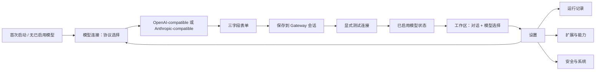

# P12：AionUi 与 AtomCode 工作台信息架构调研

状态：实施前调研完成

## 1. 用户问题与复现线索

用户提供的实际界面文本表明，当前 Workbench 把 Gateway 未附着说明、运行时快照、运行轨迹、控制面诊断、安全审计、组件锁、原生宿主、发布证据、本地模型健康、商业模型连接和扩展中心堆叠在一个长页面中。该布局让用户必须穿过冷路径审计信息才能抵达核心任务输入或模型设置；同时 `Failed to fetch` 与 HTML 返回体解析错误在没有明确操作分支的情况下暴露给用户。

因此 P12 的首要目标不是增加更多卡片，而是实现**对话优先、设置独立、连接优先**的信息架构。默认首页必须是第三方模型连接，常规工作区必须只保留任务对话、会话状态、模型选择和最小控制；高级诊断只能出现在设置的二级页面。

## 2. 参考产品的源码证据

| 参考 | 源码/文档证据 | 可本地化结论 |
|---|---|---|
| AionUi 路由 | `Router.tsx` 把 `/conversation/:id`、`/settings/model`、`/settings/agent`、`/settings/skills`、`/settings/tools`、`/settings/system` 建成独立 lazy route；旧路径用 redirect 兼容。 | 工作区、模型连接与系统诊断应成为独立页面，而不是同一页的纵向区块；保留旧导航映射避免链接失效。 |
| AionUi 侧栏 | `Sider/index.tsx` 在非设置态展示新对话、固定功能和可滚动会话历史；进入 `/settings/*` 后替换为 `SettingsSider`；底部设置按钮可返回最后的非设置页面。 | 采用双态侧栏：工作区态服务会话；设置态展示二级设置导航，并提供返回工作区。 |
| AionUi 设置二级导航 | `SettingsSider.tsx` 的顺序为 Agent、Model、Skills、Tools、Appearance、WebUI、System、About，并按“AI core / App / About”分组。 | 将本项目的模型连接设为第一个 AI core 子页；运行记录、扩展、审计和 Windows 证据归类到系统/开发者子页。 |
| AionUi 模型配置 | `ModeSettings.tsx` 将模型配置独立托管；`ModelModalContent.tsx` 只在保存/测试时触发明确动作，并提供 provider 级管理与状态反馈。官方入门引导为 `Settings → Models → Add Model → API key → Save`。[1] [2] | 新手路径必须把“选择协议 → 填写显示名称、模型、API key → 保存并测试”限定为一个短向导，测试与高级控制另外展开。 |
| AtomCode | `app.tsx` 让主视图保持对话和会话恢复；`Sidebar.tsx` 明确将新会话、历史与底部设置分离；`ModelSelector.tsx` 把已配置模型的切换紧邻对话输入，而不是混入设置表单。 | 工作区不承载 provider 配置表；只显示当前已启用模型与“去连接模型”快捷入口。模型配置完成后，应在工作区输入区附近可见并可切换。 |

> AionUi 的公开入门文档将首个可用对话的前置条件定义为：从侧栏设置进入 Models，添加模型提供商并保存 API key；它的对话入口再单独处理会话、Agent 与已配置模型选择。[1]

## 3. P12 交互原则

| 原则 | P12 落地 |
|---|---|
| 默认云 API 优先 | 首次进入与侧栏“模型连接”都打开 Provider Setup；本地模型仅作为“更多选项”。 |
| 两种常用协议 | 一级选择只有 **OpenAI-compatible** 与 **Anthropic-compatible**；预设提供商只是快捷填充，不要求理解 endpoint。 |
| 三字段完成 | 默认表单仅有“显示名称”“模型名称”“API key”。`protocol` 和预设在卡片中确定；Base URL 只在“自定义端点”展开后可编辑。 |
| 显式状态机 | 每步显示未开始、已保存到会话、已启用、测试成功/失败；失败显示可行动的中文建议，而不是浏览器 JSON 解析错误。 |
| 工作区短路径 | 新建任务、已启用模型选择、任务对话和必要审批留在工作区；不显示控制面审计长卡片。 |
| 设置双态导航 | 进入设置后显示“模型连接、运行记录、扩展与能力、安全与系统”二级项；返回工作区复原上次任务上下文。 |
| 安全不降级 | 密钥继续仅留 Gateway 会话内存；不在表单回填、账本、任务事件、快照或 DTO 中出现。 |

## 4. P12 计划的页面与点击路径

## References

[1] [AionUi Getting Started — Settings → Models → Add Model](https://github.com/iOfficeAI/AionUi/wiki/Getting-Started)

[2] [AionUi LLM Configuration — preset providers and custom OpenAI-compatible configuration](https://github.com/iOfficeAI/AionUi/wiki/LLM-Configuration)

[3] [AtomCode Documentation — first-run configuration, sessions, models and settings](https://atomcode.atomgit.com/docs/en/)

[4] [AionUi source — Router.tsx](https://github.com/iOfficeAI/AionUi/blob/main/packages/desktop/src/renderer/components/layout/Router.tsx)

[5] [AionUi source — SettingsSider.tsx](https://github.com/iOfficeAI/AionUi/blob/main/packages/desktop/src/renderer/pages/settings/components/SettingsSider.tsx)

[6] [AtomCode source — WebUI ModelSelector.tsx](https://atomgit.com/atomgit_atomcode/atomcode)

## 5. P12 本地生产预览交互验证

2026-08-20 在 Workbench production preview 中验证：应用默认进入“模型连接”设置态；侧栏显示“返回工作区”以及模型连接、已连接模型、运行记录、扩展与能力、安全与系统二级入口。点击 `Anthropic-compatible` 后，服务卡片缩减为 `Anthropic Claude`，显示名称预填为“我的 Anthropic Claude”，模型名称预填为 `claude-opus-5`，且页面仍只展示显示名称、实际模型名称、API key 三个输入项。该验证未提交任何密钥、未附着 Gateway、未触发供应商网络请求。

进一步生产预览验证：从设置态点击“返回工作区”后，工作区只显示任务欢迎、模型连接快捷条、最小运行时快照、任务活动与输入框；控制面诊断、安全审计、构件锁与本地模型健康均不再出现在该页面。点击侧栏“模型连接”可立即返回三步第三方 API 向导，无需滚动穿过诊断内容。

继续验证：点击“查看已连接模型”进入独立的高级连接页，页面只呈现刷新、状态、显式测试和受限文本调用说明；点击“运行记录”进入只包含 P11 产出/检查点账本和追加式轨迹的页面。两页均未与新手 API key 表单混排，且运行记录明确显示 `NO AUTO-RESUME` 和不可重放语义。
