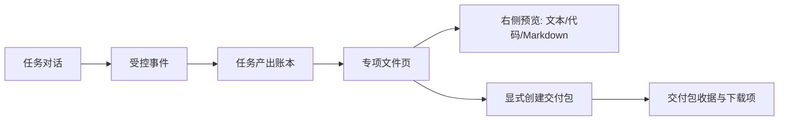

# P13：任务专属文件、代码协作与交付包模式调研

**日期：** 2026-08-20  
**范围：** AionUi、VS Code Agents、Open WebUI、OpenClaw、AnythingLLM、Cherry Studio、OpenCode 的公开文档、源码与议题。  
**目的：** 为 AI Work OS 设计“对话即工作台”的任务专属文件能力：在同一任务中让用户查看受控产出、阅读代码、预览可渲染文件，并显式创建可下载交付包。

## 1. 可验证的产品模式

| 参考 | 已证实的交互/边界 | 对 AI Work OS 的本地化结论 |
|---|---|---|
| AionUi | Preview Panel 将 AI 生成、文件点击和对话引用统一到可多标签预览面板；其文档列出代码、Markdown、HTML、图片、PDF、Office、Diff 等预览类型，以及版本历史与 workspace 同步。[1] | 采用**任务专属文件页 + 右侧预览**，首期仅实现低风险文本/代码/Markdown/JSON 与 metadata 卡片；二进制预览按 MIME allowlist 逐步增加。 |
| VS Code Agents | Agents window 将 agent-first 会话与工作区关联；Files、Changes 与集成预览是相互独立的任务表面，用户可先审查 diff 再提交。[2] | 不把文件写入混入聊天文本。文件清单、变更摘要、预览和“显式打包”作为独立 UI 区域；每项操作保持可审查。 |
| Open WebUI | Artifacts 是从对话中分离出来的可渲染工作产物，使用右侧专用窗口、版本选择和单独的预览隔离策略。[3] | 对 HTML 等可执行/可渲染内容采用单独的受限预览容器；主 Workbench CSP 不放宽，不使用 `unsafe-eval`。 |
| OpenClaw | 文档把 workspace 作为 agent 的工作目录，但明确提醒它只是默认 cwd、并非硬隔离；配置、凭据和会话状态应与 workspace 文件分离。[4] | 每个 task/run 使用固定的受控 artifact 根；任务文件与 Gateway 配置、API key、SQLite 运行状态物理分离。所有路径解析后必须验证 containment。 |
| AnythingLLM | 文档区分 thread-scoped attachment 与 workspace-scoped 文档；扩大可见范围是一个显式动作，且 context 大小需要可见管理。[5] | P13 的文件页默认严格按 task/run 范围隔离；以后若增加“固定到工作区”，必须显式确认并显示范围变化。 |
| Cherry Studio | 已完成的设计通过 tool-call observation 产生 first-class `generated-file` data part，而非解析模型文本；文件卡片显示名称、类型、大小、预览与下载，并要求 path containment、大小上限与受限扩展名。[6] | 以**版本化 artifact event / ledger**作为唯一文件出现来源。禁止从 LLM 文本中的路径猜测文件；返回 DTO 只含脱敏 metadata，不含文件字节。 |
| OpenCode | 当前公开议题提议 artifact tool 只接收项目相对路径、仅返回 metadata、按需读取字节用于预览或下载，并限制类型与大小。[7] | 页面通过只读 artifact metadata 查询列出文件；将来预览/导出采用独立的、按需、带 task/run/ID 校验的读取通道。 |

## 2. 对话即工作台的首期信息架构

工作区左侧保持任务和会话入口；主对话中仅显示**任务级文件计数与最近受控产出**，避免把大文件树塞进消息流。用户点击“专项文件”进入该 task/run 的文件清单。中间区域查看文件 metadata 与生成顺序；右侧区域展示只读源码或渲染预览。没有活跃任务时页面显示空状态，而不会列出其他任务或系统目录。

## 3. P13 非谈判安全不变量

> **生成文件不是模型文本。** 只有 Gateway 受控工具事件或已验证 artifact 事件可以写入任务产出账本；模型回复中的 `/path`、URL、Markdown 链接或 base64 不得自动变成文件卡片。

| 不变量 | 具体要求 |
|---|---|
| 范围 | 查询和打包都必须同时携带匹配的 `taskId`、`runId`、artifact ID；绝不提供全盘或任意 workspace 浏览。 |
| 路径 | artifact 只保存/接受相对引用；服务器解析真实路径后必须拒绝 traversal、符号链接逃逸和根目录外文件。 |
| 类型与大小 | 首期 allowlist：`.txt`、`.md`、`.json`、`.csv`、`.ts`、`.tsx`、`.js`、`.py`、`.rs`、`.css`、`.html`。预览与交付包各自有明确大小/数量上限。禁止 `.exe`、`.dll`、脚本的自动执行。 |
| 数据 | API key、token、HTTP header、prompt、tool 参数、原始模型输出、绝对路径、SQLite 文件不得出现在文件 DTO、预览或包清单中。 |
| 打包 | “创建交付包”是用户显式 intent，不由 artifact 出现自动触发；产出 ZIP 后只返回收据、文件计数、总大小、哈希和受控下载引用。 |
| 预览 | 文本/代码只读；HTML 预览要单独收紧为无网络、无 host bridge 的沙箱。主桌面 CSP 继续禁止 `unsafe-eval`。 |

## 4. 采用与暂缓

首批实现采取 AionUi 的“右侧预览”与 VS Code 的“Files/Changes 独立于对话”结构；采用 Cherry Studio 的 event-driven 文件卡片、OpenCode 的 metadata-first 读取思想和 OpenClaw 的状态/凭据分层。不会复制上游实现或品牌资源。

暂缓项包括：用户任意目录读写、自动运行 shell、自动打包、HTML/JS 未隔离执行、二进制 Office/PDF 复杂渲染、Git 写入、文件历史恢复和跨 task 文件共享。它们需要在可验证的权限、存储和预览边界完成后再单独评估。

## References

[1]: https://github.com/iOfficeAI/AionUi/wiki/Preview-Panel-Guide "AionUi Preview Panel Guide"
[2]: https://code.visualstudio.com/docs/agents/agents-tutorial "Tutorial: Agentic coding in VS Code"
[3]: https://docs.openwebui.com/features/chat-conversations/chat-features/code-execution/artifacts/ "Open WebUI Artifacts"
[4]: https://docs.openclaw.ai/concepts/agent-workspace "OpenClaw Agent workspace"
[5]: https://docs.anythingllm.com/chatting-with-documents/introduction "AnythingLLM: Using Documents in Chat"
[6]: https://github.com/CherryHQ/cherry-studio/issues/15708 "Cherry Studio: In-Conversation File Downloads for Agent-Generated Artifacts"
[7]: https://github.com/anomalyco/opencode/issues/41768 "OpenCode: present generated image and PDF artifacts in web sessions"
